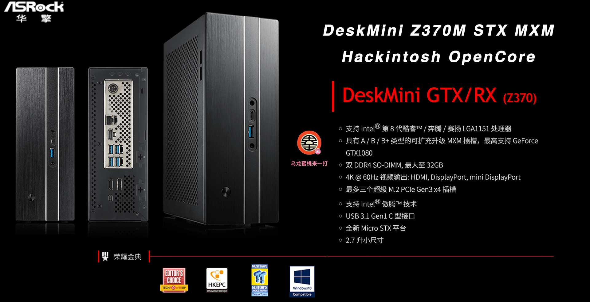
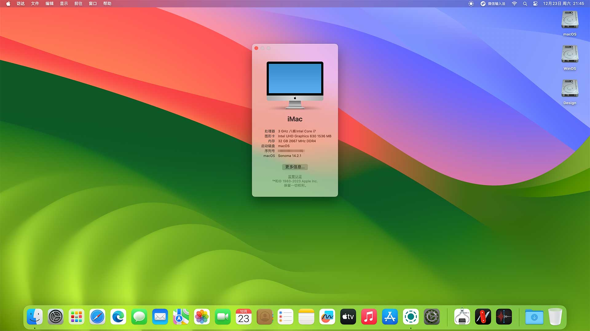

# ASRock DeskMini Z370 Hackintosh OpenCore EFI



### [简体中文](README.zh_CN.md)

### OpenCore

[OpenCore 0.9.7](https://github.com/acidanthera/OpenCorePkg)

### OS Version Tested

- macOS Monterey 12.x
- macOS Ventura  13.x 
- macOS Sonoma  14.x 


### Hardware

- BIOS Version：P4.20  2020-05-22
- Motherboard：ASRock Z370M-STX-MXM
- CPU：Intel 9th i9-9900 ES （QQBZ）
- iGPU：Intel UHD 630
- GPU：AMD RX5500XT MXM 8G
- Memo：XIEDE 16G (8G*2）DDR4 2666 Mhz
- SSD：SN350 480G Windows 11 
- SSD：WD SN750 500G MacOS
- SSD：SN750 500G Data
- HDA: Realtek ALC233
- LAN: Intel L219-V
- WiFI: BCM94360CS2

### BIOS

```

Advanced
  |-- CPU Configuration
      |-- CPU C states Support: Enabled
      |-- CFG Lock: Disabled
  |-- Chipset Configuration
      |-- Above 4G Decoding: Enabled
      |-- VT-D: Enabled
      |-- IOAPIC 24-119 Entries: Disabled
      |-- Onboard HD Audio: Enabled
      |-- Share Memory: 64MB
      |-- IGPU Multi-Monitor: Enabled
      |-- Virtual Battery Control: Disabled
  |-- USB Configuration
      |-- XHCI Hand-off: Enabled 

Security
  |-- Secure Boot: Disabled 
  |-- Intel Platform Trust Technology:: Enabled 

Boot 
  |-- Fast Boot: Disabled
  |-- CSM: Disabled
```

### Notes

 - Use [OpenCore Configurator](https://mackie100projects.altervista.org/opencore-configurator/) build your SMBIOS
 - Use the Power button to wake up from sleep

### ScreenShot



### Contact Us 

- QQ Group: 23304408

